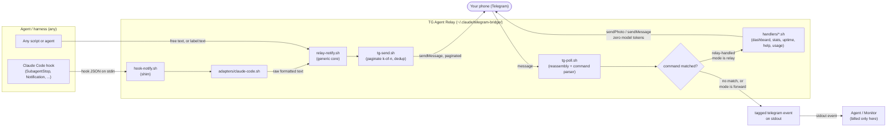
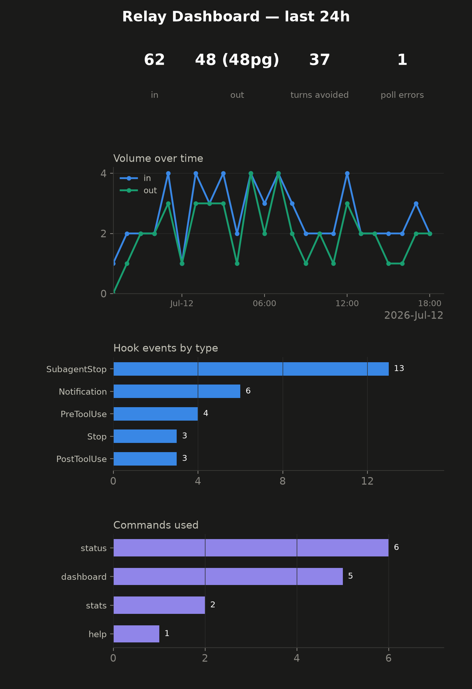
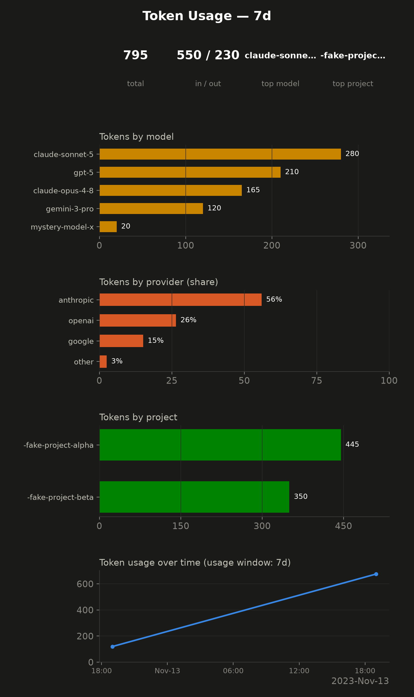

# TG Agent Relay

**An agent/harness-agnostic Telegram relay:** full-output, paginated status
pings go out to your phone for free; reassembled messages and commands come
back in; and a set of built-in dashboard/stats commands answer straight from
the relay — zero model tokens either direction unless *you* start a
conversation.

[](LICENSE)
[](https://github.com/tzervas/tg-agent-relay/actions/workflows/gitleaks.yml)

Built with pure `curl` + `jq` + **Python 3.14** (preferred; 3.13 ok; ≥3.11
minimum via `lib/python.sh` / `RELAY_PYTHON`) stdlib — no framework, no
external services, no listening port.

> **Repo/directory note:** this repo is named `tg-agent-relay` on GitHub
> (renamed from `claude-telegram-bridge` — GitHub auto-redirects the old
> URL). The **local working copy stays at `~/.claude/telegram-bridge/`** —
> that path is baked into a live Claude Code hook config and other agents'
> script invocations, so it's left unchanged deliberately. The name
> mismatch (repo `tg-agent-relay`, directory `telegram-bridge`) is
> cosmetic only.

## Why

Two channels, deliberately split so **status pings cost zero model
tokens** and you are only billed when *you* message the bot:

- **Outbound status → phone (0 model tokens):** any agent/harness calls
  [`relay-notify.sh`](relay-notify.sh) (generic) or a harness-specific
  [adapter](adapters/) → `tg-send.sh` (auto-paginating `[k/n]` over
  Telegram's 4096-char cap) → Telegram. Hook-driven pings run outside the
  model, so automated status never spends tokens.
- **Inbound phone → agent (billed only here):** `tg-poll.sh` long-polls
  `getUpdates`, **allowlisted strictly to your numeric `ALLOWED_USER_ID`**
  (every other sender is silently ignored — the security boundary),
  reassembles a rapid burst of messages into one event, and either
  forwards it to the agent or — for a small set of built-in commands —
  answers it itself, at zero model tokens.

## Architecture



- **Outbound (top path):** agent/hook → adapter or `relay-notify.sh` →
  `tg-send.sh` → Telegram → your phone. Never costs a model turn.
- **Inbound (bottom path):** phone → Telegram → `tg-poll.sh`. A flushed
  message is either **relay-handled** (a built-in command like
  `/dashboard` runs a local script and replies via `sendPhoto`/
  `sendMessage` — zero model tokens) or **forwarded** as a
  `[telegram] ...` / `[telegram:cmd:<tag>] ...` line on stdout for your
  agent's event source (a `Monitor`-style loop) to read — costing a model
  turn only when you actually send something.

## The dashboard, at a glance

`/dashboard` renders a dark-friendly, mobile-legible multi-panel PNG
(header stats, volume-over-time, hook-event breakdown, command usage) via
`sendPhoto` — no model involved. Illustrative example (synthetic data —
see [`docs/assets/README.md`](docs/assets/README.md)):



If `matplotlib`/`python3` aren't available, the same data renders as a
unicode/text dashboard instead — see
[`docs/assets/dashboard-example.txt`](docs/assets/dashboard-example.txt).
Either way, `/dashboard` never fails to send *something*.

## Token usage dashboard (opt-in)

**Disabled by default.** `/usage` renders tokens by **provider**
(Anthropic/OpenAI/Google/other), **model**, and **project**, aggregated
from a harness's local session-transcript logs (one adapter ships today —
Claude Code's own `~/.claude/projects/**/*.jsonl`). Illustrative example
(synthetic fixture data — see [`docs/assets/README.md`](docs/assets/README.md)):



**Privacy first, read before enabling:** everything stays local
(transcripts are never touched outside your machine, the aggregate cache
is gitignored) and the render goes only to your own allowlisted Telegram
chat — never any other network call. See
[`docs/USAGE.md`'s "Token usage dashboard" section](docs/USAGE.md#token-usage-dashboard)
for the full opt-in config and privacy note before turning `[usage]` on.

## Quickstart

```bash
# 1. Create a bot via @BotFather in Telegram, copy the token
# 2. Put it in a local, gitignored .env
cp .env.example .env
echo 'BOT_TOKEN=<paste-your-token-here>' >> .env   # or edit .env directly
chmod 600 .env

# 3. Message your new bot once (any text), so the relay can learn your id
# 4. Go live — validates the token, resolves your id, sends a confirmation DM
bash go-live.sh
```

Full walkthrough (including optional `relay.toml` config and wiring an
adapter): see [`SETUP.md`](SETUP.md).

**Releases & local upgrade:** [`docs/RELEASING.md`](docs/RELEASING.md) —
`scripts/release.sh vX.Y.Z` publishes a GitHub Release;  
`scripts/deploy-local.sh [--ref vX.Y.Z]` updates `~/.claude/telegram-bridge`
without touching `.env` / `relay.toml` / runtime state.

## In use

### (a) Wiring to Claude Code

Already wired for you: `~/.claude/settings.json`'s `hooks.SubagentStop` /
`hooks.Notification` call `hook-notify.sh`, a thin shim that `exec`s
[`adapters/claude-code.sh`](adapters/claude-code.sh) — which parses the
hook's JSON payload, builds a one-line summary per event type, and hands
it to `relay-notify.sh --raw`:

```json
{
  "hooks": {
    "SubagentStop": [{ "hooks": [{ "type": "command", "command": "~/.claude/telegram-bridge/hook-notify.sh" }] }],
    "Notification": [{ "hooks": [{ "type": "command", "command": "~/.claude/telegram-bridge/hook-notify.sh" }] }]
  }
}
```

`adapters/claude-code.sh` understands **all 30 documented Claude Code hook
events**, not just these two — see [Installing hooks](#installing-hooks-for-more-events)
below to wire any of the rest.

### (b) Wiring to Grok Build / Grok CLI (full provider)

All **14 documented Grok Build hooks** are implemented as a provider
extension ([`providers/grok`](providers/grok/), [`docs/PROVIDERS.md`](docs/PROVIDERS.md)):

```bash
# Defaults on: Stop, StopFailure, SubagentStop, Notification, PostToolUseFailure
# Opt-in the rest via [grok.<Event>] enabled = true in relay.toml, then:
bash install-grok-hooks.sh --dry-run
bash install-grok-hooks.sh
```

Writes `~/.grok/hooks/tg-agent-relay.json`. Runtime:
`hook-notify-grok.sh` → `adapters/grok.sh` → `lib/provider_hook.py grok`.
Usage: `[usage] source = "grok"` or `"multi"`.

### (c) Multi-backend + project rooms (one bot, many agents)

Optional. Configure `[backends.*]` + `[[chats]]` / `/project bind` so:

- **Project rooms** — forum topic *or* whole group per repo (`/project bind <slug>`)
- **Backends** — sticky per room or via prefixes (`@claude …`, `@grok …`, `@ollama …`)
- Replies tagged (`[claude · mycelium] …`) so you know who answered

See **[`docs/ROUTING.md`](docs/ROUTING.md)**. Hybrid **agent** context (vision vs
text, exclusive — no double-dip): [`docs/context/README.md`](docs/context/README.md).

### (d) Wiring to ANY other agent/harness

No adapter needed for plain text — call the generic entry point directly:

```bash
# raw text
~/.claude/telegram-bridge/relay-notify.sh "Deploy finished OK"

# structured (adds an optional [generic].prefix from relay.toml)
echo '{"label":"deploy","text":"finished OK"}' \
  | ~/.claude/telegram-bridge/relay-notify.sh
```

If your harness has its own structured event shape worth parsing (like
Claude Code's hook JSON), copy
[`adapters/generic-example.sh`](adapters/generic-example.sh) and write a
dedicated adapter — see [`adapters/README.md`](adapters/README.md).

### (e) A status ping arriving on the phone

A `SubagentStop` hook firing produces a DM like:

```
✅ code-reviewer finished — Found 2 issues in the diff, both low severity
```

A long message (e.g. a full tool output) is auto-paginated, with a
**bolded** `[k/n]` page header (see "Structured formatting" below):

```
[1/3]
✅ build finished — Compiling mycelium-core v0.4.0 ...
```

**Structured formatting (v0.3.0 — on by default):** a longer, richer
report — the kind of message that used to arrive as an unreadable wall of
text — renders with real hierarchy instead. Before/after, the same
message:

<table>
<tr><th>Before (v0.2.x — a wall of text)</th><th>After (v0.3.0 — structured)</th></tr>
<tr><td>

```text
Findings: found the issue in format_message()
in swap.myc -- it wasn't validating a swap
before applying it. before: fn swap(v: Value)
-> Value { v.as_dense() } after: fn swap(v:
Value) -> Result<Value, SwapError> {
v.as_dense().ok_or(SwapError::OutOfRange) }
note: an out-of-range swap is now an explicit
Result, not a silent truncation. all tests
green (165/165)
```

</td><td>

**Findings**

Found the issue in `format_message()` in
`swap.myc` — it wasn't validating a swap
before applying it.

```myc
// before
fn swap(v: Value) -> Value {
    v.as_dense()
}

// after
fn swap(v: Value) -> Result<Value, SwapError> {
    v.as_dense().ok_or(SwapError::OutOfRange)
}
```

> Never-silent: an out-of-range swap is now an
> explicit `Result`, not a silent truncation.

**✅ TESTS GREEN (165/165)**

</td></tr>
</table>

The right-hand column is exactly what arrives on the phone — a bolded
header, a monospace `inline code` reference, a real **code box** for the
`myc` diff (Telegram renders `mycelium`/`myc` fences as a monospace box,
byte-for-byte verbatim — never reflowed or re-marked-up), a quoted note,
and a bolded closing line — instead of one dense paragraph. See
"Structured formatting" below for the full input-markup convention and
config, and [`docs/USAGE.md`](docs/USAGE.md#structured-formatting-outbound-messages)
for more examples.

### (d) Sending `/dashboard` → image back

```
You:  /dashboard
Bot:  [sends a PNG: Relay Dashboard — last 24h]
```

Zero model tokens — `tg-poll.sh` matches the command, backgrounds
`handlers/dashboard.sh`, which renders and sends the image (or the
text-fallback dashboard) directly. See
[`docs/COMMANDS.md`](docs/COMMANDS.md) for the full command table.

### (e) A plain message → forwarded to the agent

```
You:  can you check the CI run on PR 42?
```

`tg-poll.sh` sees no command match and emits, on its own stdout:

```
[telegram] can you check the CI run on PR 42?
```

for your agent's `Monitor`-style event loop to pick up as its next input —
this is the only inbound path that costs a model turn.

### Installing hooks for more events

`adapters/claude-code.sh` handles all 30 documented Claude Code hook
events, but only the two live in `~/.claude/settings.json` today
(`SubagentStop`, `Notification`) actually fire — Claude Code only invokes a
hook if `settings.json` says to. To wire up more (or fewer), don't hand-edit
`settings.json`: enable/disable events in `relay.toml`, then run

```bash
~/.claude/telegram-bridge/install-hooks.sh          # sync settings.json to relay.toml
~/.claude/telegram-bridge/install-hooks.sh --dry-run  # preview the plan, change nothing
~/.claude/telegram-bridge/install-hooks.sh --uninstall # remove every relay-added hook entry
```

It reads each event's `[claude_code.<Event>].enabled` from `relay.toml`
(falling back to that event's own install-time default — five events
default on, the rest are opt-in; see `relay.toml.example`), and
reconciles `hooks.<Event>` in `~/.claude/settings.json` accordingly.
**Idempotent and merge-not-clobber**: it only ever touches the ONE hook
entry it owns per event (identified by its own `hook-notify.sh` command
path) — every other key in `settings.json`, and every other tool's hook
entry for the same event, is left exactly as it was. Re-running it after
editing `relay.toml` is the normal workflow; running it with no change is
a reported no-op. It never writes an invalid `settings.json` — the result
is JSON-validated before AND after the write, and a `settings.json` that
already fails to parse is left untouched with a nonzero exit rather than
guessed at.

## Configurable via `relay.toml` (optional)

Copy [`relay.toml.example`](relay.toml.example) to `relay.toml` to
configure page size/delay, the reassemble window, structured message
formatting, which Claude Code hook events are enabled + their prefix +
their message format, the `[generic]` prefix/format, in-chat commands,
the dashboard window, optional local TTS voice notes, and the opt-in
token-usage dashboard. **Every script falls back to its pre-existing
env-var/hardcoded default with no `relay.toml` present** — this is the
backward-compat guarantee: an existing bridge with no `relay.toml`
behaves byte-for-byte as it always has — **with one deliberate exception,
`[format]` below**, which is ON by default. See the example file's
comments for the full schema, and [`docs/USAGE.md`](docs/USAGE.md) /
[`docs/COMMANDS.md`](docs/COMMANDS.md) for how to use it.

### Structured formatting — phone-readable messages (v0.3.0, on by default)

`tg-send.sh` runs every outbound message through
[`lib/format.sh`](lib/format.sh) before it hits Telegram's API, turning a
wall of text into a message with real visual hierarchy — using the
formatting Telegram actually supports (`parse_mode=HTML`: dynamic
soft-wrap at word boundaries, bolded section headers, real code boxes,
expandable quotes, light emphasis), since Telegram has no true font
sizes. See "(c) A status ping arriving on the phone" above for a full
before/after example.

**Your plain message text drives it** — a small, documented input-markup
convention:

| Write this | Get this |
|---|---|
| `## Header` | **Header** (bold, blank line above) |
| `✅ SHORT CAPS` or `🚀 Title Case` (leading emoji + short all-caps/Title-Case) | **bolded header** — an ordinary lowercase sentence stays plain prose, never mistakenly bolded |
| ` ```lang ... ``` ` | a real code box (`<pre><code>`) — content is **never** reflowed, wrapped, or marked up, only HTML-escaped, byte-for-byte verbatim |
| `` `inline code` `` | monospace `inline code` |
| `> quoted line(s)` | a blockquote (auto-**expandable** if long) |
| `*emphasis*` / `_emphasis_` | *italic* — word-boundary-guarded, so `my_var_name` outside backticks is never mistaken for emphasis |

**Code fences recognize the common language tags** (`rust`, `python`,
`bash`, `json`, `yaml`, `toml`, `go`, `js`, `ts`, `java`, `sql`, `diff`,
...) — and **`myc`/`mycelium` are first-class tags** (both normalize to
`language-mycelium`), since Mycelium is this ecosystem's own language. An
unrecognized tag still boxes the code, just without a language class.

Config — `relay.toml`'s `[format]` table, every key optional and on by
default:

```toml
[format]
enabled = true
parse_mode = "HTML"   # "HTML" (default) | "MarkdownV2" (not yet rendered,
                       # logged + falls back to plain text) | "none"
wrap_width = 50        # soft-wrap width, phone-friendly default
headers = true
code_spans = true
blockquotes = true
soft_wrap = true
```

`enabled = false` (or `parse_mode = "none"`) restores today's exact
plain-text behavior, byte-for-byte — the one opt-out you need if you'd
rather keep receiving raw text. **Never-silent:** a render that would
produce malformed HTML, or a Telegram-side HTML-parse rejection, retries
ONCE as plain text and logs the fallback via `.metrics.log` — a message
is never dropped nor sent with broken markup. See
[`docs/USAGE.md`](docs/USAGE.md#structured-formatting-outbound-messages)
for the full writeup and more examples.

### Syntax-highlighted code — inline alias + an opt-in HTML document (v0.5.0)

**The hard constraint.** Telegram message *text* supports no color at all
— a fixed HTML entity set, no `<span>`/color attribute of any kind, and
`<pre>`/`<code>` can't even *nest* `<b>`/`<i>` around individual tokens
(see the structured-formatting section above). So true per-token colored
highlighting **inside a chat bubble is structurally impossible as text** —
`<pre><code class="language-X">` (what `[format]` already emits for a
fenced block, unconditionally, unchanged) only lights up on a Telegram
**client** that ships its own highlighter, and even then it's
monochrome-per-message-theme, never truly per-token colored.

**Two tiers, both live today:**

1. **The always-on inline box, now Mycelium-aware.** A `myc`/`mycelium`
   fence's inline `<pre><code>` box now emits `language-rust` instead of
   the literal `language-mycelium` — Telegram's client highlighter has
   never heard of Mycelium (an in-development language), but its built-in
   **Rust** highlighter colors Mycelium reasonably well (Rust-family
   syntax: `fn`/`let`/`match`/`impl`/strings/comments/generic types all
   align; only Mycelium-unique keywords like `nodule`/`phylum`/`swap`
   render as plain identifiers — never actively wrong). Zero-infra,
   already shipping, configurable (`[code_highlight].myc_inline_lang`,
   default `"rust"`).
2. **An opt-in, host-highlighted HTML document — the exact tier.** With
   `[code_highlight] mode = "html-doc"`, each fenced block is
   *additionally* rendered host-side to a self-contained HTML file (all
   CSS inlined — no external stylesheet, no network fetch to view it —
   [`lib/code_highlight.py`](lib/code_highlight.py), `pygments`'
   `HtmlFormatter`) and sent via Telegram's `sendDocument`. Opened in the
   phone's browser: real per-token colors on **any** device, no local
   highlighter needed, and the code stays selectable/copyable right there
   in the document — using the repo's own
   [`MyceliumLexer`](lib/code_highlight.py) for the unique keywords too.

This extends `lib/format.sh`'s existing fenced-code handling
([`lib/code_highlight.sh`](lib/code_highlight.sh) reuses its exact fence
regex) — it never replaces or removes the inline box, only adds the
document alongside it.

A `myc`/`mycelium` block:

```myc
// nodule: example
nodule example

fn swap(v: Value) -> Result<Value, SwapError> {
    v.as_dense().ok_or(SwapError::OutOfRange)
}
```

with `mode = "html-doc"` sends the inline box (colored on-phone via the
rust alias) **and** a `snippet.myc.html` document (opened in-browser: full
per-token color, including `nodule`/`swap`/`fuse` correctly recognized as
Mycelium keywords via the real lexer) — paired with a `<pre>` caption on
the document itself so the code is readable without even opening it. A
rendered example of both tiers for this exact snippet (synthetic, not
real code) is committed at
[`docs/assets/code-highlight-example.html`](docs/assets/code-highlight-example.html)
/ [`.txt`](docs/assets/code-highlight-example.txt) — see
[`docs/assets/README.md`](docs/assets/README.md).

Config — `relay.toml`'s `[code_highlight]` table, every key optional:

```toml
[code_highlight]
mode = "inline-only"      # "off" | "inline-only" (DEFAULT, no-op) | "html-doc"
theme = "monokai"          # a dark pygments style for the document; dracula/native/... also work
line_numbers = false
max_lines = 60              # a block over this many lines skips the document render
keep_text = "caption"       # "caption" (omitted, never truncated, if >1024 chars) | "none"
myc_inline_lang = "rust"    # applies UNCONDITIONALLY, regardless of mode - see below
```

`mode = "inline-only"` (the default) and `"off"` are behaviorally
identical — the always-on inline box, nothing more; opt into
`mode = "html-doc"` for the extra document. **Never-silent:**
`pygments` absent, an oversized block (`max_lines`), or a genuine render
failure just means no document is sent for that one block — the inline
box already carries the full code either way, so nothing is ever
dropped, and every skip is logged via `.metrics.log`. See
[`docs/USAGE.md`](docs/USAGE.md#syntax-highlighted-code) for the full
writeup.

### Voice messages (TTS) — self-hosted, off by default

`tg-send.sh` can also generate a **voice note** locally from a message's
text and send it via Telegram's `sendVoice` — **no external TTS API**;
piper or espeak-ng run entirely on this machine. Opt in via `relay.toml`'s
`[tts]` table (`mode = "text+voice"` sends text then voice; `"voice-only"`
sends only voice, falling back to text if TTS is unavailable — a message
is never dropped). Default `mode = "off"` means the feature is inert with
no `relay.toml`, or an existing one that doesn't set it — identical
behavior to before TTS existed.

**Recommended: piper + a medium/high voice model** for natural-sounding
speech (espeak-ng is the zero-config fallback — always available, but
robotic). One-liner: `./fetch-voices.sh` fetches the recommended deep-male
voice (`en_US-joe-medium`) into `./voices/`; `./fetch-voices.sh --list`
shows every recommended voice (male + female). Then:

```toml
[tts]
mode = "text+voice"
engine = "piper"
voice_model = "/root/.claude/telegram-bridge/voices/en_US-joe-medium.onnx"
length_scale = "0.81"   # optional cadence tweak — see below; this is the
                          # tuned, approved-final default for this voice
max_chars = 600
```

See `relay.toml.example`'s `[tts]` comments for the full schema (including
the optional `pitch` depth knob and `length_scale` cadence knob, piper's
own `--length-scale` — lower is faster; `"0.81"` above is this bridge's
recommended cadence, with `pitch` left off) and
[`SETUP.md`](SETUP.md#voice-messages-tts-optional) for installing piper
or espeak-ng.

### Hook pings get voice too (v0.5.1)

Automated hook pings (`SubagentStop`, `Notification`, ...) are tagged
`TG_SEND_SOURCE=hook` by `adapters/claude-code.sh`, and by default get a
voice read-through even when the ping is long or gets split into several
`[k/n]` pages — a direct/manual `tg-send.sh` call stays under the
original, stricter rule (a single page within `max_chars`). This closes
the exact gap that used to leave every hook ping text-only: hook pings
routinely carry a full agent message and so are routinely over
`max_chars`/multi-page.

```toml
[tts]
mode = "text+voice"
hook_voice = true              # default; false restores the old hook-is-text-only shape
spoken_mode = "short"          # default: one short voice clip (see below)
spoken_max_chars = 600         # short-mode word-boundary cap (spoken chars after strip)
```

The **text send is never affected** — every page still goes out
unabridged, even in `mode = "voice-only"` (a hook ping always sends text;
voice is purely additive).

### Spoken length: short default, full-mode recipe

**Default `spoken_mode = "short"`** — after the plain-text strip, the
spoken prose is truncated at a word boundary to `spoken_max_chars`
(default 600) and sent as **one** voice clip. A truncation is logged to
`.metrics.log` (`tts hook_voice_truncated`). The Telegram **text bubble
always stays full and unabridged**; only the voice is shortened.

**Opt in to a full read-through** with `spoken_mode = "full"` — the
entire spoken prose is covered, split at word boundaries into ordered
clips of `clip_max_chars` (default 1500; `hook_voice_max_chars` is the
legacy alias when `clip_max_chars` is unset). Set `clip_max_chars = 0`
for a single unbounded clip. Multi-clip events log
`tts hook_voice_chunked`.

#### Full-mode user recipe

Copy this into your `relay.toml` when you want the whole message read
aloud (maintainer-style personal config):

```toml
[tts]
mode = "text+voice"
spoken_mode = "full"
clip_max_chars = 1500
collapse_adjacent_refs = true                   # default true
voice_code_ref = "ref. the message for the code"
voice_link_ref = "ref. the message for the link"
```

**Ordering:** voice note(s) are generated once from the complete,
pre-pagination message and sent **first**, then the (unabridged, formatted)
text pages — hear the summary (or full read), then see pages for
reference/detail (code, links, exact figures). The v0.5.1
serialized-send guarantee (`flock` on `.tg-send.lock` +
`[general].send_interval_ms`) still holds: one invocation's voice+pages
always complete, in this order, before the next invocation begins.

Writing your own adapter? Tag any unattended/automated event the same way
— see `adapters/README.md` step 6.

### The voice reads clean prose, not symbols (v0.5.2+)

Before any voice note is synthesized, the message is stripped to a
plain-text transcript (`lib/tts_plain_text.py`) so the engine reads
**words, never formatting symbols** — no `##` headers, `*`/`_` emphasis,
`` ` ``/```` ``` ```` code, `<b>`/`<pre>` HTML tags, `&lt;`-style entities
(unescaped to the real character), `>` quotes, `[k/n]` page headers, or
`-`/`*`/`N.` list markers. **Call/tool/request IDs** (UUIDs, `call_*`,
`toolu_*`, long hex tokens, …), **URLs**, and **code/backticks** are not
spoken — code and links become short spoken references; IDs are dropped.
**The sent text message keeps its full formatting and full length** —
only the voice's input is stripped.

```toml
[tts]
speak_code = false                              # default; a code span/block becomes a spoken reference…
voice_code_ref = "ref. the message for the code"  # …this phrase (set speak_code=true to read code verbatim)
voice_link_ref = "ref. the message for the link"  # a [label](url) → "label, <ref>"; a bare URL → "link, <ref>"
collapse_adjacent_refs = true                   # default; consecutive identical refs collapse to one
```

So `## Deploy done` · `see *the logs* at [dashboard](https://…)` · a
```` ```rust … ``` ```` block reads aloud as *"Deploy done … see the logs
at dashboard, ref. the message for the link … ref. the message for the
code"* — clean prose that points you back to the chat bubble for the code
and the link. `spoken_max_chars` / `clip_max_chars` count these *spoken*
characters (applied after stripping).

### Guaranteed send ordering (v0.5.1)

Every `tg-send.sh` invocation serializes under an exclusive `flock` on
`.tg-send.lock`, so a burst of concurrent sends (several hook events
firing close together) queue up and go out **one at a time** — each
send's text pages and voice note complete before the next begins —
instead of racing independently against the Telegram API, where network
scheduling gives no ordering guarantee. A small, configurable delay is
held after each send finishes before the next may begin, so Telegram's
own delivery also preserves order:

```toml
[general]
send_interval_ms = 350   # default; 0 disables the extra pause (mutual
                          # exclusion via flock still applies)
```

Needs `flock` (util-linux — present on essentially every Linux box); if
it's missing, sending proceeds unserialized exactly as before this
feature existed, logged once to `.metrics.log` (never a hard failure).

### Per-event message templates

Beyond `enabled`/`prefix`, every `[claude_code.<Event>]` table (and
`[generic]`, for the harness-agnostic path) accepts a `format` string with
`{placeholder}` interpolation, e.g.:

```toml
[claude_code.SubagentStop]
format = "{prefix} {agent} done: {message}"
```

With no `format` set, an event renders its original built-in default text
— unchanged. See `relay.toml.example`'s per-event comments for each
event's available placeholders, and `adapters/claude-code.sh`'s header for
the full per-event field reference.

## In-chat commands (user → agent)

`tg-poll.sh` recognizes a leading `/slash` command or a configured
keyword prefix (`status ...`, `pause ...`) defined in `relay.toml`'s
`[commands.<name>]` tables, and tags the emitted event:

```
[telegram:cmd:status] status: how's it going?      # matched a command
[telegram] just a regular message                    # no match (unchanged)
```

**With no `relay.toml` (or no `[commands.*]` section), nothing is ever
tagged** — every message emits exactly as `[telegram] <text>`, today's
behavior.

A command can also be **relay-handled** (`mode = "relay"` + `handler`)
instead of forwarded — the relay runs a local script and answers
directly, at zero model tokens, instead of ever emitting the event to the
agent. Five such commands ship today (`/dashboard`, `/stats`, `/uptime`,
`/help`, `/usage` — the last opt-in, see "Token usage dashboard" above) —
see [`docs/COMMANDS.md`](docs/COMMANDS.md) for what each does and how to
define your own.

## Files

| File | Purpose |
|---|---|
| `.env.example` | Secret config template (committed). Copy to `.env` and fill `BOT_TOKEN`. |
| `.env` | **Local-only, gitignored, 0600** — holds the live bot token. Never committed. |
| `relay.toml.example` | Non-secret config template (committed). Copy to `relay.toml` to customize. |
| `relay.toml` | **Local-only, gitignored** — your actual config. Optional; scripts fall back gracefully without it. |
| `tg-send.sh` | Outbound `sendMessage`; silent no-op with no token; 10s dedup; auto-paginates (`[k/n]`) over `page_size`/`TG_PAGE_SIZE` (default 3500) chars; structured formatting (`[format]`, default ON); optional local TTS voice note (`[tts]`, default off, with a relaxed `hook_voice` rule for `TG_SEND_SOURCE=hook` pings, v0.5.1); every send serializes under a `flock` (`[general] send_interval_ms`, v0.5.1) for guaranteed ordering. |
| `lib/format.sh` | Structured-formatting layer (`[format]`, v0.3.0, on by default) — dynamic soft-wrap, bolded headers, code boxes (`myc`/`mycelium` first-class), quotes, emphasis, via `parse_mode=HTML`; never-silent fallback to plain text on a bad render or a Telegram-side rejection. |
| `lib/code_highlight.sh` | Host-highlighted code documents (`[code_highlight]`, v0.5.0) — extends `lib/format.sh`'s fenced-code handling: `mode = "html-doc"` additionally renders each fenced block to a self-contained HTML file via `lib/code_highlight.py`, sent with `sendDocument`, paired with a copyable `<pre>` caption; the always-on inline code box is unaffected either way. Default `mode = "inline-only"` is a no-op. |
| `lib/code_highlight.py` | `pygments` → self-contained HTML document renderer (`HtmlFormatter(noclasses=True)`, optional dep, skip-graceful like `lib/tts.sh`'s piper/`lib/dashboard_render.py`'s matplotlib — no Pillow needed) — includes a native `MyceliumLexer` (`myc`/`mycelium`, a Declared best-effort lexical approximation) plus pygments' own `get_lexer_by_name` for everything else, with a plain-text fallback for an unrecognized tag. |
| `lib/tts.sh` | Self-hosted TTS pipeline (text → WAV via piper/espeak-ng → OGG/OPUS via ffmpeg → `sendVoice`), skip-graceful with no engine/ffmpeg installed. Strips the message to clean spoken prose (`_tts_plain_text` → `lib/tts_plain_text.py`, v0.5.2) before synthesis. |
| `lib/tts_plain_text.py` | Markdown/HTML → clean spoken-prose stripper (v0.5.2): removes formatting symbols + unescapes entities so the voice reads words, and references (never voices) code + URLs (`[tts].voice_code_ref`/`voice_link_ref`/`speak_code`). The sent text is unaffected; only the voice's input is stripped. |
| `fetch-voices.sh` | One-command piper voice model downloader (`.onnx` + `.onnx.json`, sha256-verified, skip-graceful); no args fetches the recommended default (`en_US-joe-medium`), `--list` shows the full recommended table. |
| `tg-poll.sh` | Inbound long-poll; strict id-allowlist; emits `[telegram] <text>` (or `[telegram:cmd:<tag>] <text>` for a recognized command); reassembles a rapid burst into one event after a quiet gap; routes `mode = "relay"` commands to a `handlers/` script instead. |
| `relay-notify.sh` | **Generic, harness-agnostic entry point** — any agent/script can send a status update through it directly. |
| `adapters/claude-code.sh` | Claude Code hook-JSON adapter — parses the payload, formats a per-event summary, calls `relay-notify.sh --raw`. |
| `adapters/generic-example.sh` | Copy-paste stub for writing a new harness adapter. |
| `adapters/README.md` | How to write an adapter for any harness. |
| `hook-notify.sh` | **Backward-compatible shim** — wired into `~/.claude/settings.json`; just `exec`s `adapters/claude-code.sh`. |
| `install-hooks.sh` | One-command, idempotent, merge-not-clobber installer/uninstaller — syncs `~/.claude/settings.json`'s Claude Code hook entries to whatever's `enabled` in `relay.toml`. |
| `lib/relay-config.sh` | Optional `relay.toml` loader (`cfg_get`/`cfg_has_section`), shared by every script. |
| `lib/relay-common.sh` | Shared helpers (`oneline`, `cap_if_huge`, `emit_metric`, `render_template`). |
| `lib/claude-code-events.sh` | Single source of truth for the documented Claude Code hook event list + each event's install-time default enabled/disabled + default prefix — shared by `adapters/claude-code.sh` and `install-hooks.sh`. |
| `lib/toml_to_json.py` | `relay.toml` → JSON (Python stdlib `tomllib`; the only TOML-parsing code in the repo). |
| `lib/metrics_agg.py` | Pure/stdlib metrics aggregation over `.metrics.log` (used by the dashboard/stats/uptime handlers, unit-tested independently of matplotlib). |
| `lib/dashboard_render.py` | Renders the multi-panel dashboard PNG (matplotlib), degrading to the text renderer on any failure. Also renders the opt-in token-usage panels/image. |
| `lib/usage_ingest.py` | **Opt-in** (`[usage].enabled`), pure/stdlib token-usage aggregation by provider/model/project — adapters: `claude-code` (recursive project JSONL), `grok` (context-peak proxy), `multi`/`auto`. Windows: `today`/`all`/`lifetime`/`Nd|h|w|m|y`. |
| `lib/routing.sh` | Multi-backend route resolve (sticky chat, prefix, default) + outbound tags. |
| `adapters/grok.sh` / `install-grok-hooks.sh` | Grok Build hook adapter + installer (`~/.grok/hooks/tg-agent-relay.json`). |
| `docs/ROUTING.md` | Multi-backend / multi-chat / project-isolation guide. |
| `handlers/` | Relay-handled-command scripts for `mode = "relay"` in `relay.toml` — `dashboard.sh`, `stats.sh`, `uptime.sh`, `help.sh`, `usage.sh` ship today; see [`docs/COMMANDS.md`](docs/COMMANDS.md) and [`handlers/README.md`](handlers/README.md). |
| `.metrics.log` | **Local-only, gitignored, auto-created** — a TSV event log (`emit_metric`) that the dashboard/stats/uptime commands read. |
| `.usage/` | **Local-only, gitignored, auto-created, opt-in** — the token-usage aggregate cache `handlers/usage.sh`/`dashboard.sh` write when `[usage].enabled = true`. Never committed; see the privacy note in `docs/USAGE.md`. |
| `go-live.sh` | Validates the token, auto-resolves your id, sends the "🟢 live" DM. |
| `watch-go-live.sh` | Optional: waits for a token to appear, then runs `go-live.sh`. |
| `SETUP.md` | Step-by-step setup + security notes. |
| `docs/USAGE.md` | How to send status, receive/reassemble messages, run commands, and read the dashboard. |
| `docs/COMMANDS.md` | The built-in commands, relay-handled vs. forwarded, and how to define your own. |
| `ROADMAP.md` | Where this is headed. |

## Security

- **Allowlist by numeric `user_id`**; all other senders are silently
  ignored — never forwarded, never logged with content.
- **Bot token lives only in the local `.env`** (gitignored, 0600) — never
  in the repo. `relay.toml` (if you create one) holds no secret either.
- **Outbound-only.** Telegram bots work by your machine *polling out*
  (`getUpdates`) and *pushing out* (`sendMessage`/`sendPhoto`) — no
  inbound port is ever opened on this machine.
- **Secret-scanned:** [gitleaks](https://github.com/gitleaks/gitleaks)
  runs as a pre-commit hook (`.pre-commit-config.yaml`) and a CI check
  (`.github/workflows/gitleaks.yml`) on every push/PR, including a
  repo-specific rule for this bot token's exact shape (`.gitleaks.toml`).

See [`SETUP.md`](SETUP.md#security-model) for the full security model.

## License

MIT — see [`LICENSE`](LICENSE). Copyright (c) 2026 Tyler Zervas.
